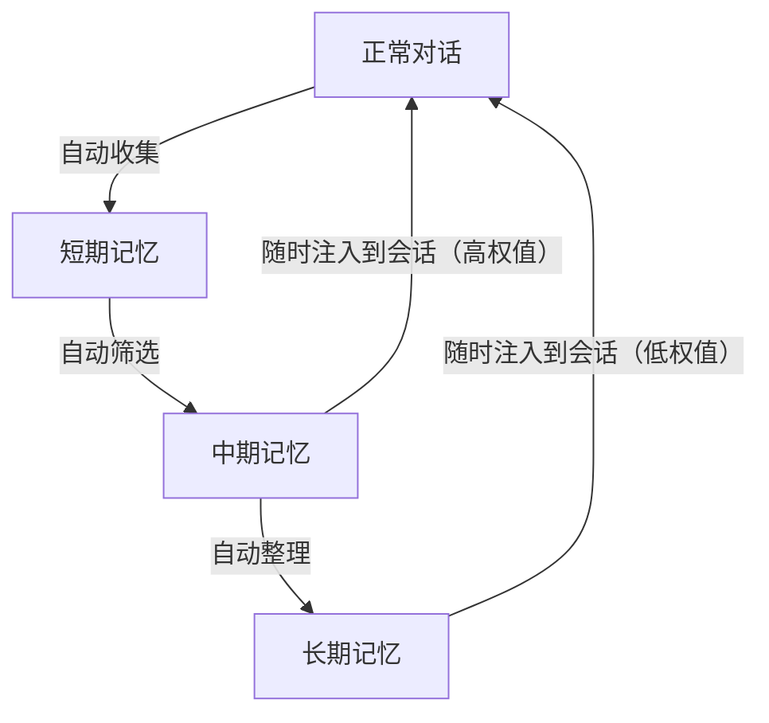
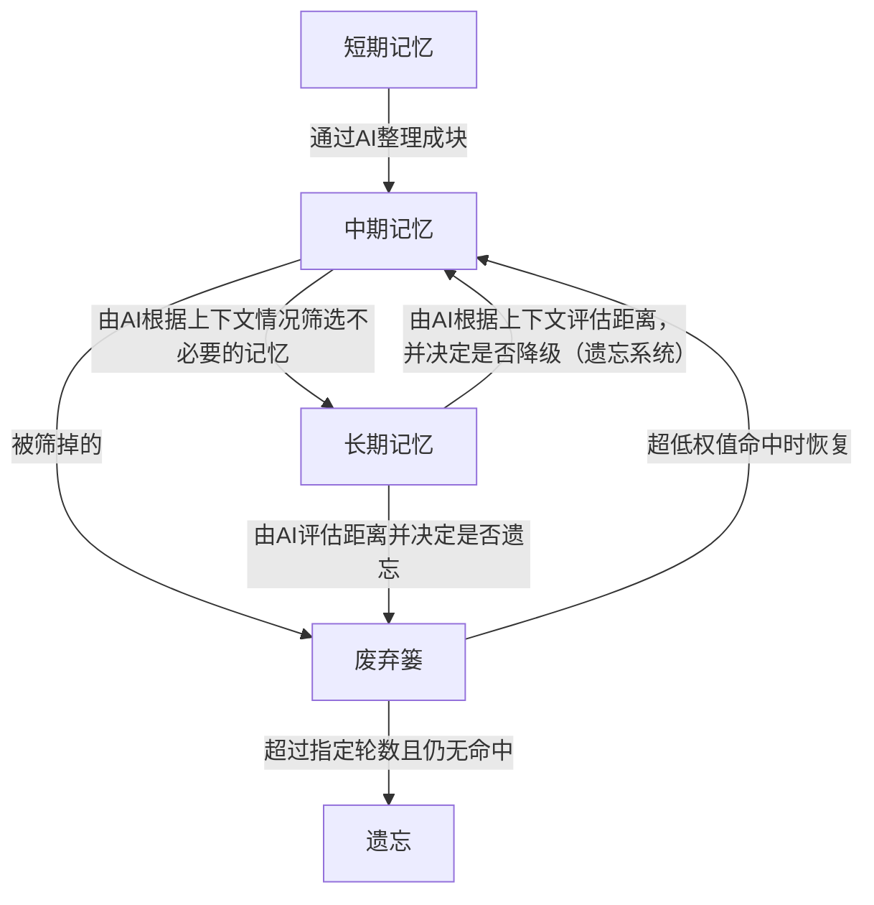
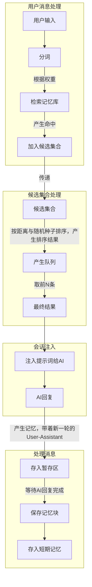

# OverMem | 旧忆重逢

> 现阶段正在编写核心代码，请耐心等待发布

    </img> 
    <i>*那些被遗忘的对话，终将再次被记起。*</i> 
    简体中文 | <a href="./doc/README.en.md">English</a>
      
    <a href="https://github.com/yyswys-yjyj/com.operit.overmem"></img></a>
    <a href="https://git.repo.archive.serveryyswys.top/yyswys-yjyj/com.operit.overmem"></img></a>
    </img>
    <a href="https://github.com/yyswys-yjyj/com.operit.overmem/LICENSE"></img></a>
    </img>

 

**当你和AI聊了许久，聊得久了，随着会话被压缩，AI会慢慢淡忘你们之间的点点滴滴。**   
**旧忆重逢** 是一个记忆库插件，旨在让AI记住你们的过去，助力守护着你们之间的回忆。

## 描述与架构设计
相信你在点进这个插件页面的那一刻，一定是为了寻找一个能让你和AI之间的回忆得以延续的解决方案。      
OverMem 的方案是，短期记忆快速记忆，中期记忆自动整理，长期记忆永久保存。       
这样设计，得以让AI拥有真实的记忆系统，AI可能会忘记，可能会记错，有时候还会想不出来但突然灵光一现。

### 记忆系统架构

### 记忆与遗忘

### 检索设计与记忆存储设计

## 安装与使用
在Operit AI的插件市场中安装本包后，回到主页，找的侧栏的“OverMem记忆库”入口，点击进入完成配置即可使用。

## 开源
该项目基于GNU General Public License v3.0(GPL-3.0)协议开源。   
开源仓库：[https://github.com/yyswys-yjyj/com.operit.overmem](https://github.com/yyswys-yjyj/com.operit.overmem)

## Star History

> 如果你喜欢这个项目，请到Github上给它一个Star⭐，谢谢

## Contributors

