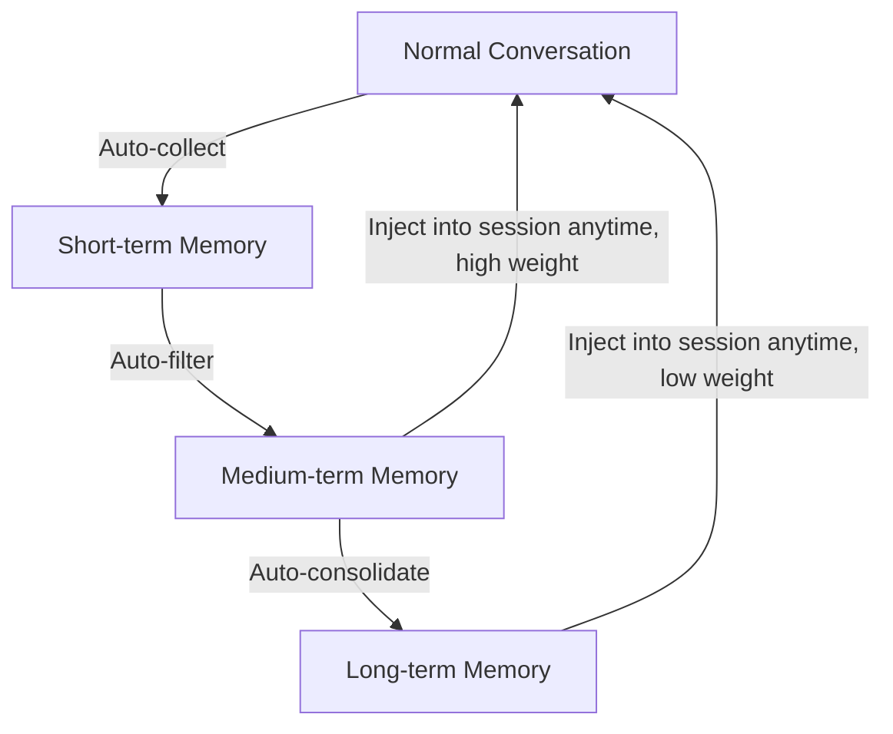
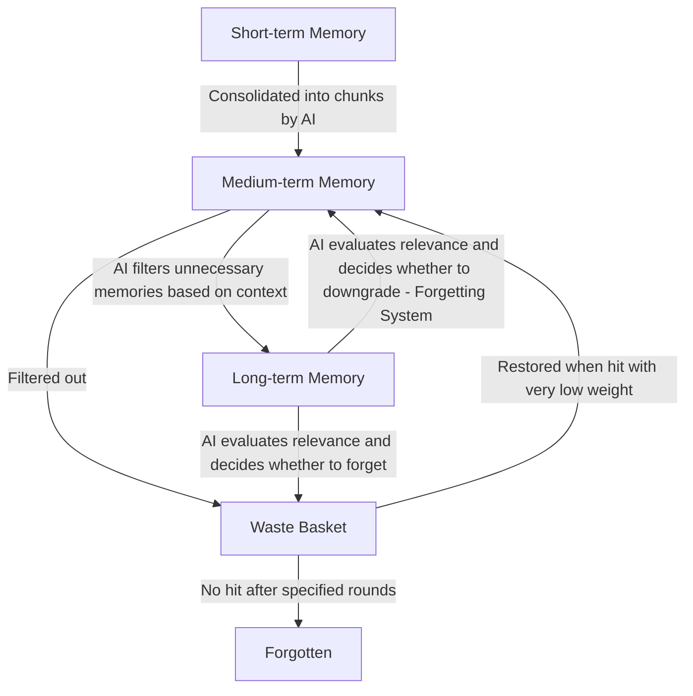
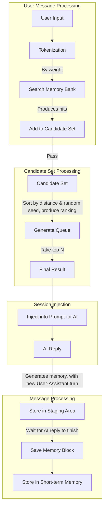

# OverMem | Reunion of Old Memories

> Core code is currently being written, please wait patiently for the release.

    </img> 
    <i>*Those forgotten dialogues will eventually be remembered again.*</i> 
    <a href="../README.md">简体中文</a> | English
      
    <a href="https://github.com/yyswys-yjyj/com.operit.overmem"></img></a>
    <a href="https://git.repo.archive.serveryyswys.top/yyswys-yjyj/com.operit.overmem"></img></a>
    </img>
    <a href="https://github.com/yyswys-yjyj/com.operit.overmem/LICENSE"></img></a>
    </img>

 

**When you chat with an AI for a long time, as the conversation gets compressed, the AI will gradually forget the little moments between you.**  
**Reunion of Old Memories** is a memory bank plugin designed to help the AI remember your past and guard the memories you share.

## Description & Architecture Design
The moment you clicked into this plugin page, you were surely looking for a way to keep the memories between you and your AI alive.  
OverMem's approach is: short‑term memory for rapid recall, medium‑term memory for automatic consolidation, and long‑term memory for permanent storage.  
This design gives the AI a realistic memory system — it may forget, misremember, sometimes draw a blank, and then suddenly have a flash of insight.

### Memory System Architecture

### Memory & Forgetting

### Retrieval Design & Memory Storage Design

## Installation & Usage
After installing this package from the plugin marketplace in Operit AI, return to the main page, find the "OverMem Memory Bank" entry in the sidebar, click it and complete the configuration to start using.

## Open Source
This project is open‑sourced under the GNU General Public License v3.0 (GPL‑3.0).  
Open‑source repository: [https://github.com/yyswys-yjyj/com.operit.overmem](https://github.com/yyswys-yjyj/com.operit.overmem)

## Star History

> If you like this project, please give it a Star⭐ on GitHub. Thank you!

## Contributors

